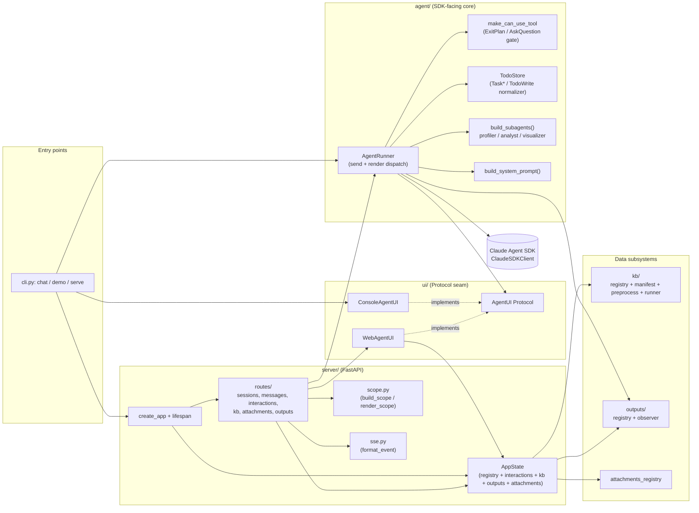
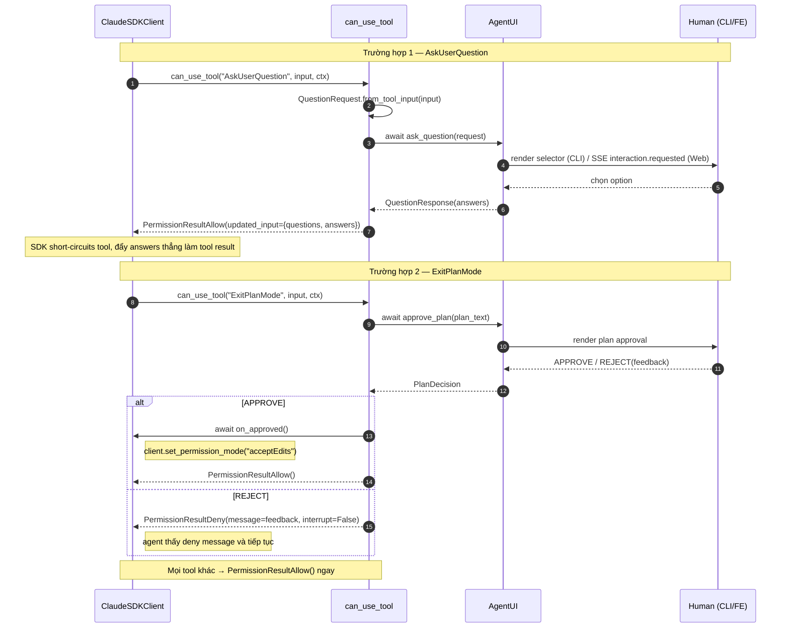
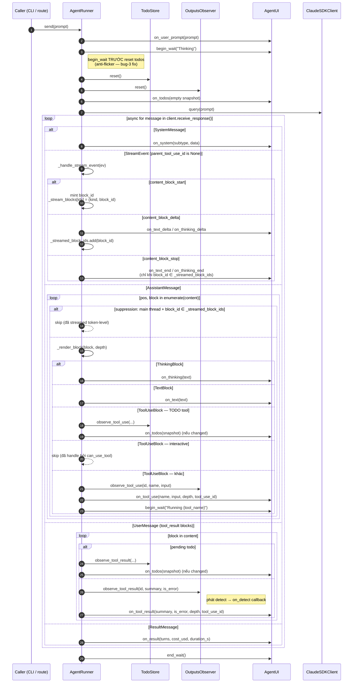
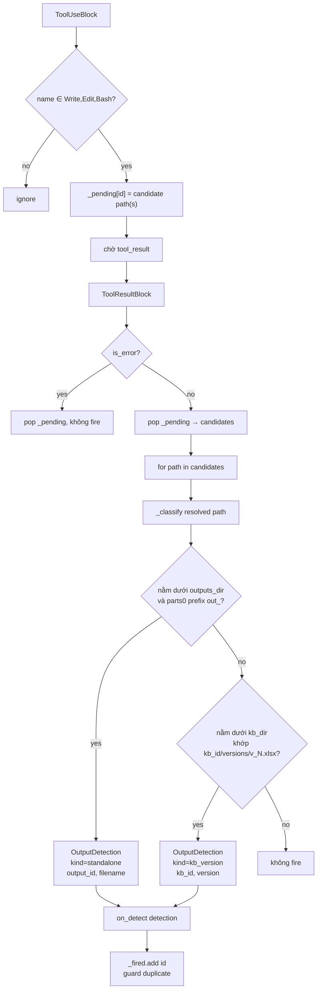
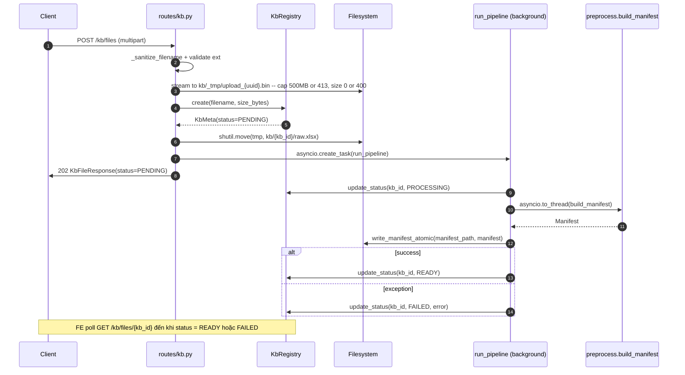
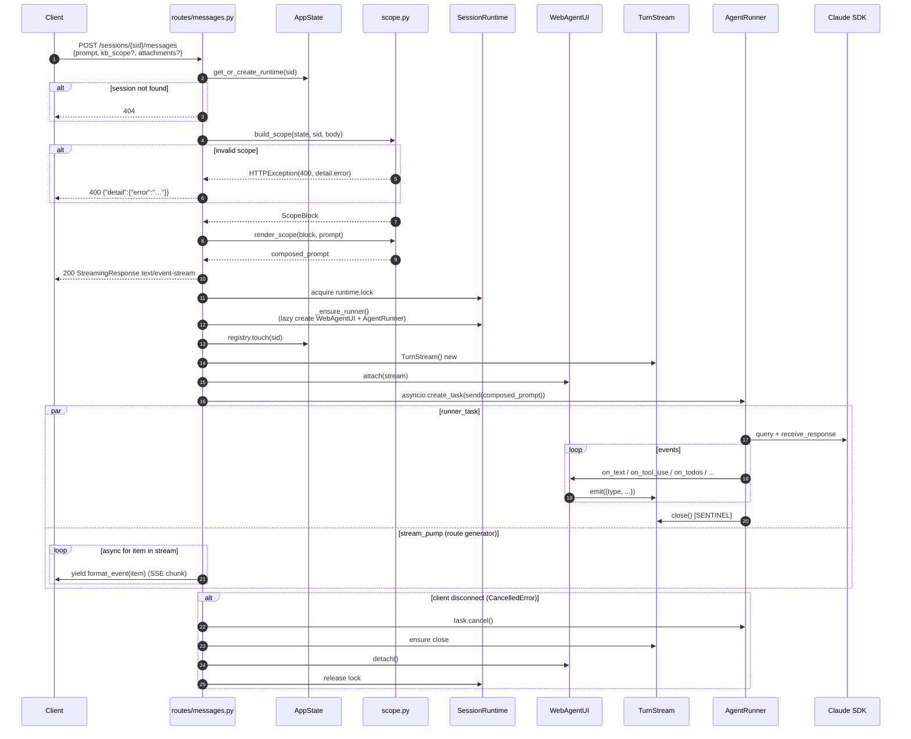
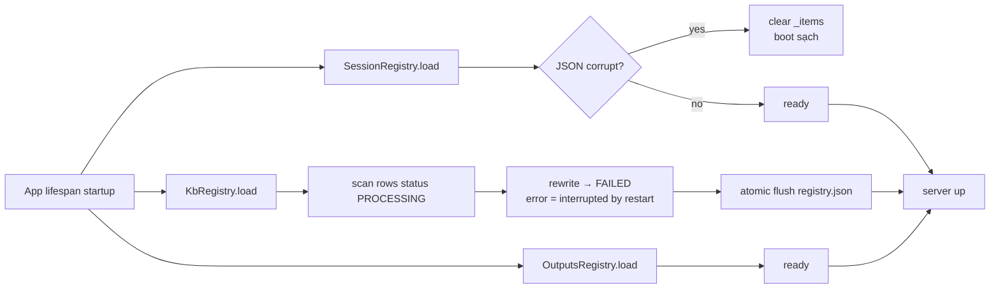

# Module Explanation — `da-agent-be`

> Tài liệu này mô tả chi tiết từng module trong hệ thống `da-agent-be`: vai trò, public API, các điểm tinh tế (invariant / seam / bug-fix history), và các sơ đồ Mermaid biểu diễn core logic của hệ thống.
>
> Phạm vi: toàn bộ `src/da_agent/` (CLI + agent core + UI Protocol + FastAPI server + KB pipeline + Outputs registry).

---

## 0. Tổng quan kiến trúc

`da-agent-be` là một Excel data-analyst agent đặt trên Claude Agent SDK, triển khai dưới hai bề mặt sử dụng:
- **CLI** (`da-agent chat` / `da-agent demo`) — single-user REPL với `rich` overlay + `prompt_toolkit` selector.
- **HTTP server** (`da-agent serve`) — FastAPI + Server-Sent Events; backend cho frontend React (`da-agent-fe`).

Cả hai bề mặt **chia chung agent core** (`agent/`) và **chia chung Protocol** (`ui/base.py::AgentUI`). Sự khác biệt nằm ở triển khai UI: CLI dùng `ConsoleAgentUI` (`ui/console.py`), web dùng `WebAgentUI` (`server/web_ui.py`).



**Ba seam quan trọng phải bảo toàn:**
1. **`AgentUI` Protocol** (`ui/base.py:19`) — runtime-checkable Protocol; nơi duy nhất mà agent core nói chuyện với UI.
2. **`make_can_use_tool` factory** (`agent/permissions.py:33`) — closure async được SDK gọi cho mọi tool. Là điểm chặn duy nhất cho `AskUserQuestion` + `ExitPlanMode`. Không có MCP server nào nữa.
3. **`TodoStore` + `OutputsObserver`** — passive observers; không tự push event, chỉ trả `bool changed` để runner quyết định gọi UI.

---

## 1. Entry points: `__init__.py`, `__main__.py`, `cli.py`

### `__init__.py` + `__main__.py`
- **Vai trò**: Re-export 3 symbol public của package: `AgentRunner`, `Settings`, `ConsoleAgentUI`. `python -m da_agent` ⇒ `cli.main()`.

### `cli.py` — CLI entrypoint
- **Vai trò**: Routing duy nhất tới 3 mode (`chat`, `demo`, `serve`); không chứa business logic, chỉ wire-up các layer.
- **Public API**:
  - `main()` — parse args, dispatch.
  - `run_chat(settings)` — async REPL: `ConsoleAgentUI` + `AgentRunner` + `prompt_toolkit.PromptSession`; hỗ trợ slash command `/plan` để re-enter plan mode.
  - `run_demo(settings)` — scripted demo (không cần API key); gọi trực tiếp `ui.approve_plan()` / `ui.ask_question()` để chứng minh full UI flow.
  - `run_server(settings, host, port)` — `create_app(settings)` rồi `uvicorn.run(...)`.

---

## 2. `config.py` — Settings + path resolution

- **Vai trò**: Single source of truth cho runtime settings + path resolution. Không phụ thuộc thư viện ngoài stdlib.
- **Public API**:
  - `find_project_root(start?) -> Path` — walk upward tìm dir chứa `.claude/`; fallback `<file>.parents[2]`. SDK cần `cwd` này để discover `.claude/skills/`.
  - `Settings` (dataclass slots):
    - Fields: `model`, `max_turns`, `plan_first`, `show_thinking`, `stream_responses`, `attachment_max_bytes` (100 MB), `scope_warn_bytes` (256 KB), `project_root`, `data_root`.
    - Properties (derived): `kb_dir`, `sessions_dir`, `outputs_dir`, `attachments_dir`, `skills_dir`. `workspace_dir` is retained as a deprecated property only — it is no longer in `add_dirs`, no longer created by `ensure_dirs`, and absent from the system prompt (spec §8.2 — all writes route through `outputs_dir` or `kb_dir/<id>/versions/` or `attachments_dir/<sid>/<att_id>/versions/`).
    - `ensure_dirs() -> None`.
- **Điểm tinh tế**:
  - Env: `CLAUDE_CONFIG_DIR=str(sessions_dir)` được set trong `AgentRunner._build_options()`, **không** trong `Settings` — `Settings` chỉ expose path. Đồng thời FastAPI app lifespan (`server/app.py`) mirror cùng giá trị vào `os.environ` của parent process khi enter và restore khi exit, để `claude_agent_sdk.get_session_messages` (chạy trong parent process khi replay history) đọc đúng JSONL directory mà SDK subprocess ghi vào.
  - `data_root` default `~/.da-agent` (single-user local-first).

---

## 3. `agent/` — Agent core

### 3.1 `agent/events.py`

- **Vai trò**: Plain dataclasses cho mọi structured payload trao đổi giữa agent core ↔ UI. Serializable, không phụ thuộc gì ngoài stdlib.
- **Public types**:
  - Question flow: `Option`, `Question`, `QuestionRequest`, `Answer`, `QuestionResponse`.
  - Plan flow: `PlanVerdict {APPROVE, REJECT}`, `PlanDecision(verdict, feedback)`.
  - Todos: `TodoStatus {PENDING, IN_PROGRESS, COMPLETED}`, `TodoItem`, `TodoSnapshot`.
- **Note**: `TodoItem.display_text` ưu tiên `active_form` khi status là `IN_PROGRESS` và non-empty, ngược lại trả `subject`.

### 3.2 `agent/prompts.py`

- **Vai trò**: Tạo system prompt cho agent. Trả về dict `{"type": "preset", "preset": "claude_code", "append": <text>}` để layer custom instructions trên `claude_code` preset (SDK docs: *Modifying system prompts → Append to the `claude_code` preset*). Append text được structure bằng XML tags (`<role>`, `<environment>`, `<workflow>`, `<output_rules>`, `<trigger_rules>`, `<examples>`, `<output_discipline>`) theo Claude prompting best-practices — direct/imperative voice cho rules, worked examples cho fence cả 2 phía.
- **Public API**: `build_system_prompt(settings: Settings) -> dict`.
- **Tương tác**: chỉ được gọi bởi `AgentRunner._build_options()`.
- **Layout filesystem được mô tả trong append**: `kb_dir/<kb_id>/{manifest.json, raw.xlsx, versions/v_curr.xlsx, versions/v_prev.xlsx}` cho KB, `attachments_dir/<sid>/<att_id>/{<filename>, versions/v_curr.<ext>, versions/v_prev.<ext>}` cho attachment. Không có "workspace" — đã deprecate (spec §8.2).

### 3.3 `agent/subagents.py`

- **Vai trò**: Định nghĩa 3 subagent specialization (`profiler`, `analyst`, `visualizer`) — main agent dispatch qua tool `Task`.
- **Public API**: `build_subagents() -> dict[str, AgentDefinition]`.
- **Permissions**: `profiler` + `analyst` chỉ có read-only tools (Read/Bash/Glob/Grep + xlsx skill); `visualizer` thêm Write/Edit.

### 3.4 `agent/permissions.py` — `make_can_use_tool`

- **Vai trò**: Implement `can_use_tool` callback cho SDK — gate duy nhất giữa SDK và human input.
- **Public API**: `make_can_use_tool(ask_plan, on_approved, ask_question) -> async callable`. Closure được pass vào `ClaudeAgentOptions.can_use_tool`.



### 3.5 `agent/todos.py` — TodoStore

- **Vai trò**: Normalize hai họ tool (`Task*` mới và `TodoWrite` legacy) thành một `TodoSnapshot` thống nhất cho UI.
- **Public API**:
  - `TODO_TOOL_NAMES = {"TodoWrite", "TaskCreate", "TaskUpdate", "TaskList", "TaskGet"}`.
  - `TodoStore`: `reset()`, `is_pending(tool_use_id) -> bool`, `snapshot() -> TodoSnapshot`, `observe_tool_use(...) -> bool`, `observe_tool_result(...) -> bool`.
- **Điểm tinh tế**:
  - `TaskCreate` chưa tạo item lúc `tool_use` — id do SDK assign chỉ xuất hiện ở `tool_result`. Store dùng `_pending_creates` để correlate.
  - `_extract_task_id` accept hai format: regex `r"Task\s*#(\S+)\s+created successfully"` (SDK CLI native) **trước**, JSON object `{"id": ...}` / `{"task": {"id": ...}}` (transport re-encoding) là fallback. Đây là bug-fix có chủ đích — SDK thực tế emit dạng plain string.
  - "Update before create" được synthesize item rỗng để không drop row.
  - `reset()` được runner gọi đầu mỗi turn — todos là per-turn state.

### 3.6 `agent/core.py` — `AgentRunner`

- **Vai trò**: Engine trung tâm. Owns SDK session, dịch raw SDK message stream thành `AgentUI` calls. Không biết gì về `rich` hay `prompt_toolkit`.
- **Public API**:
  - `AgentRunner(ui, settings, *, on_output_detection?, resume_sdk_session_id=None)`.
  - `async __aenter__ / __aexit__` — connect/disconnect `ClaudeSDKClient`.
  - `async send(prompt, *, echo_prompt=True)` — chạy một conversational turn.
  - `async set_plan_mode()` — re-enter plan mode cho turn tiếp theo.
- **Resume seam**: `_build_options()` set `ClaudeAgentOptions(resume=self._resume_sdk_session_id)`. Khi non-None, SDK reuse JSONL transcript hiện có thay vì mint session mới; route layer truyền giá trị này từ `SessionMeta.sdk_session_id` để giữ liên tục transcript qua nhiều lần connect.

#### Sequence: `AgentRunner.send()`



**Điểm tinh tế** (mọi rule dưới đây được test cover trong `tests/test_streaming.py`):
- `_stream_blocks: dict[idx, (kind, block_id)]` — key là **SDK content-block index**, **persist cả turn** (KHÔNG pop tại `content_block_stop`). Lý do: trailing `AssistantMessage` cần lookup positional để suppress re-render.
- Suppression rule: block bị skip khi và chỉ khi `block_id ∈ _streamed_block_ids`. Block có start+stop nhưng **zero deltas** vẫn render atomic — đây là lý do counter-based approach hỏng (corrupted khi có gap-block giữa sequence).
- Subagent stream events (`parent_tool_use_id != None`) bị drop — token-level streaming trong subagent lane defer tới v1.1.
- `input_json_delta`, `signature_delta`, empty deltas, thinking deltas khi `show_thinking=False` đều bị drop.
- `on_output_detection` truyền vào constructor; CLI pass `None` → observer thành silent sink. Server wire callback vào `AppState.outputs`.

---

## 4. `ui/` — UI Protocol seam

### 4.1 `ui/base.py` — `AgentUI` Protocol

- **Vai trò**: `@runtime_checkable Protocol` định nghĩa toàn bộ contract giữa agent core và UI. Đây là seam **duy nhất** — agent core không bao giờ import `rich` / `prompt_toolkit` / FastAPI.
- **Methods**:
  - **Atomic render** (sync): `on_user_prompt`, `on_thinking`, `on_text`, `on_tool_use`, `on_tool_result`, `on_system`, `on_result`, `on_error`, `on_output`, `on_todos`.
  - **Token streaming** (sync, spec §8.6): `on_text_delta(block_id, delta)`, `on_text_end(block_id)`, `on_thinking_delta(block_id, delta)`, `on_thinking_end(block_id)`. `block_id` là server-minted opaque (`txt_<12hex>` / `thk_<12hex>`).
  - **Wait label** (sync): `begin_wait(label)`, `end_wait()`.
  - **Interactive** (async, block on human): `ask_question(request) -> QuestionResponse`, `approve_plan(plan) -> PlanDecision`.

### 4.2 `ui/console.py` — `ConsoleAgentUI`

- **Vai trò**: Implement `AgentUI` cho CLI dùng `rich` (render) + `prompt_toolkit` (interaction). Quản lý `rich.Live` overlay duy nhất cho spinner + todo list.
- **Điểm tinh tế**:
  - Token streaming flush tại `*_end` bằng cách gọi atomic `on_text` / `on_thinking` — inline streaming sẽ conflict với `rich.Live` re-render.
  - Spinner label bị override bởi `todos.in_progress.display_text` nếu có todo đang chạy.
  - `on_output()` là no-op trong CLI — file đã trên disk, user tự tìm theo path đã print.

### 4.3 `ui/prompts.py`

- **Vai trò**: TUI cho question selector (multi-tab multi-choice) và plan approval, dùng `prompt_toolkit`. Inline (non-fullscreen).
- **Public API**: `run_question_selector(request)`, `confirm_plan()`, `build_selector_app(questions)` (tách riêng để test có thể drive mà không cần TTY).
- **Fallback**: `_fallback_select()` plain `input()` khi không có TTY (pipe/demo).

---

## 5. `outputs/` — Outputs detection + registry

### 5.1 `outputs/observer.py` — `OutputsObserver`

- **Vai trò**: Passive observer, observe Write/Edit/Bash tool calls để detect output files. Phân loại thành:
  - `standalone` — path nằm dưới `outputs_dir/<output_id>/`.
  - `kb_version` — path khớp pattern `kb_dir/<kb_id>/versions/v<N>.xlsx`.
  - Ambiguous: bỏ qua.
- **Public API**:
  - `OutputDetection(kind, file_path, output_id?, filename?, kb_id?, version?)` — dataclass.
  - `OutputsObserver(outputs_dir, kb_dir, on_detect)`:
    - `reset()` — clear pending + fired (gọi đầu mỗi turn).
    - `observe_tool_use(id, name, input)` — stage Write/Edit/Bash nếu match.
    - `observe_tool_result(id, content, is_error)` — pop pending, classify, gọi `on_detect(detection)`.



- **Điểm tinh tế**:
  - `_fired` set guard chống duplicate emission khi SDK forward tool_result nhiều lần.
  - Bash extraction: regex `_BASH_REDIR_RE` chỉ match patterns rõ ràng (`> path`, `--output=path`, `--output path`) — intentionally conservative.
  - Observer là sync; server wrap `on_detect` thành async bridge để register vào `OutputsRegistry` + emit SSE.

### 5.2 `outputs/registry.py` — `OutputsRegistry`

- **Vai trò**: Persistent registry cho standalone outputs (`outputs/registry.json` + per-output dir + `meta.json` sidecar). Mirror pattern từ `KbRegistry`.
- **Public API**:
  - `OutputMeta(id, kind, title, filename, mime, size_bytes, source_session_id, source_kb_ids, created_at)`.
  - `OutputsRegistry(root)`: `load()`, `list(*, session_id?)`, `get(output_id)`, `register_standalone(...)`, `adopt_at(*, output_id, ...)`, `delete(output_id)`.
- **Điểm tinh tế**:
  - Atomic write: flush dùng `.tmp` rồi `os.replace`.
  - `_lock = asyncio.Lock()` — mọi mutation serialize.
  - `adopt_at()` dùng khi model write trực tiếp vào path `outputs_dir/out_<id>/file` mà server chưa mint id đó — idempotent: id đã tồn tại thì trả existing row.

---

## 6. `kb/` — Knowledge Base pipeline

### 6.1 `kb/registry.py` — `KbRegistry`

- **Vai trò**: Quản lý `kb/registry.json` + state machine `PENDING → PROCESSING → READY|FAILED`.
- **Crash recovery (rất quan trọng)**: `load()` quét bất kỳ row nào status `PROCESSING` và rewrite thành `FAILED, error="interrupted by restart"` rồi persist ngay. FE/user phải re-upload.
- **API**: `load`, `list`, `get`, `create`, `delete`, `update_status`. `update_status(... "FAILED", error=msg)` chỉ set `meta.error` khi status là FAILED; transition khác clear error về None.

### 6.2 `kb/manifest.py`

- **Vai trò**: Schema dataclass + atomic IO cho `manifest.json`.
- **Dataclasses**: `Column`, `Region`, `SheetSummary`, `Relationship`, `Manifest`.
- **Functions**: `write_manifest_atomic(path, manifest)` (`.tmp` + `os.replace`), `read_manifest(path) -> dict` (plain dict, vì HTTP handler chỉ cần passthrough JSON).
- **Quirk**: `Relationship.from_` (Python keyword conflict workaround) ↔ JSON key `"from"`; `to_dict()` rename để giữ wire format chuẩn.

### 6.3 `kb/preprocess.py`

- **Vai trò**: Sync blocking pipeline chạy trong executor thread — đọc `.xlsx`, profile từng sheet thành `Manifest`.
- **Entry point**: `build_manifest(raw_path, kb_id) -> Manifest`.
- **Stages**:
  1. `load_workbook(read_only=True, data_only=True)`.
  2. `_materialize_sheet` — propagate merged cells (top-left fills phần còn lại).
  3. `_detect_regions` — cluster non-blank cells, split tại fully-blank rows/columns.
  4. `_infer_header_row` — row đầu tiên trong 5 rows đầu có ≥60% string cells và không có numeric cell; fallback row 0 với `low_confidence=True`.
  5. `_collapse_multirow_headers` — join multi-row header bằng `_`.
  6. `_profile_column` — dtype, cardinality (cap `PROFILE_ROW_CAP=50000`), min/max, sample values.
  7. `_infer_relationships` — cross-sheet FK heuristic: `sample_values` overlap ≥ `FK_MIN_CONFIDENCE=0.8`; annotate `col.role = "fk?->Sheet.col"`.
- **Tunables (monkey-patchable trong tests)**: `PROFILE_ROW_CAP`, `SAMPLE_ROW_LIMIT`, `SAMPLE_VALUE_LIMIT`, `MIN_REGION_AREA`, `FK_MIN_CONFIDENCE`, `HEADER_STRING_RATIO`.

### 6.4 `kb/runner.py`

- **Vai trò**: Async orchestrator — bridge asyncio ↔ blocking pipeline; flip registry status; absorb exception thành FAILED (không re-raise).
- **API**: `run_pipeline(*, registry, kb_root, kb_id) -> None` — fire-and-forget task.
- **Điểm tinh tế**: Exception bị catch-all và ghi vào registry. Lifecycle owned bởi `AppState._kb_tasks` — `shutdown()` cancel chúng.

### 6.5 KB ingestion sequence



---

## 7. `server/` — FastAPI layer

### 7.1 `server/app.py` — Factory

- **Vai trò**: Tạo `FastAPI`, mount routers, setup CORS, điều phối lifespan.
- **Public API**: `create_app(settings: Settings | None) -> FastAPI`.
- **Lifespan**: trên enter — set `os.environ["CLAUDE_CONFIG_DIR"] = str(settings.sessions_dir)` (lưu giá trị cũ để restore) rồi `AppState(settings)` → `await registry.load()` → `await kb.load()` (sweep PROCESSING → FAILED) → `await outputs.load()` → gắn vào `app.state.app_state`. On shutdown: `await state.shutdown()` cancel KB tasks + discard runtimes; sau đó restore `CLAUDE_CONFIG_DIR` về giá trị cũ (hoặc `pop` nếu trước đó không có).
- **Lý do mirror env**: `claude_agent_sdk.get_session_messages` (dùng cho history replay) chạy trong parent FastAPI process và đọc `CLAUDE_CONFIG_DIR` từ `os.environ` — nếu không mirror, nó sẽ tìm trong `~/.claude/projects/` thay vì `settings.sessions_dir/projects/` nơi SDK subprocess thực sự ghi JSONL.
- **CORS**: `http://127.0.0.1:3000` + `http://localhost:3000`, methods/headers `*`, `allow_credentials=False`.
- **Routers**: `sessions`, `messages`, `interactions`, `attachments` (cùng prefix `/sessions`); `kb`, `outputs`. Inline `GET /health`.

### 7.2 `server/state.py` — In-process state

| Thành phần | Vai trò |
|---|---|
| `SessionMeta` / `SessionRegistry` | Dataclass + JSON registry trên disk; atomic-rename write; `asyncio.Lock`. Corrupt JSON khi `load()` → reset `_items.clear()` (không crash). `SessionMeta` có thêm field `sdk_session_id: str \| None = None` — UUID do SDK mint, captured từ `SystemMessage(subtype="init")` của turn đầu; persist qua `to_dict`/`from_dict` và registry cũ load với `None` (backward-compat). Method `set_sdk_session_id(sid, uuid) -> bool` idempotent: trả `False` mà không flush nếu giá trị unchanged, ngược lại update + atomic flush qua `_flush_locked` hiện có (`.tmp` + `os.replace`). |
| `PendingInteraction` / `InteractionStore` | `dict[sid, dict[tool_use_id, PendingInteraction]]`. `resolve` pop **trước** khi `set_result` (tránh race với re-park cùng id). |
| `TurnStream` | Per-turn `asyncio.Queue` unbounded; sentinel-closed; `emit` sau `_closed=True` là no-op (safe trong exception handler). |
| `SessionRuntime` | Lazy `runner` + `ui` + `lock: asyncio.Lock` — serialize turns trong cùng session. |
| `AppState` | Aggregate `registry`, `interactions`, `kb`, `attachments`, `outputs`. Có `_runtimes` + double-checked locking; `_kb_tasks` set tracked-cancel; `discard_runtime`; `shutdown`. |

### 7.3 `server/sse.py`

- `format_event(event: dict) -> str` — trả `"event: {type}\ndata: {json}\n\n"`. JSON với `default=str, ensure_ascii=False`.

### 7.4 `server/schemas.py` — Pydantic models

| Group | Models |
|---|---|
| Sessions | `CreateSessionRequest` (default `name="Untitled"`), `RenameSessionRequest`, `ForkSessionRequest`, `SessionResponse`, `SessionListResponse`, `MessageHistoryResponse(events: list[dict[str, Any]])` (replay payload cho `GET /sessions/{sid}/messages`, mỗi entry là wire-shape SSE event dict). |
| Messages | `MessageRequest(prompt, kb_scope?, attachments=[])`, `AttachmentRef(attachment_id)`. |
| Interactions | `AnswerSubmission`, `QuestionResponseSubmission`, `PlanResponseSubmission(verdict: Literal["approve","reject"])`, `PendingInteractionResponse`, `PendingInteractionsListResponse`. |
| KB | `KbFileResponse(status: Literal[...])`, `KbFileListResponse`, `KbVersionResponse`, `KbVersionListResponse`. |
| Attachments | `AttachmentResponse(attachment_id, filename, size_bytes, mime, uploaded_at)`, `AttachmentListResponse`. |
| Outputs | `OutputResponse(kind: Literal["standalone","kb_version"], …)`, `OutputListResponse`. |

### 7.5 `server/scope.py` — `build_scope` / `render_scope`

- **Public API**:
  - `async build_scope(*, state, sid, body) -> ScopeBlock` — raise `HTTPException(400, detail={"error": ...})`.
  - `render_scope(block, prompt) -> str` — compose `<scope>…</scope>` + `<user_prompt>…</user_prompt>`.

#### Validation table (fail-fast theo thứ tự)

| # | Điều kiện | HTTP 400 `detail.error` |
|---|---|---|
| 1 | `kb_scope == []` | `"kb_scope cannot be empty; omit the field for default-all"` |
| 2 | `kb_id` không tồn tại | `"unknown kb_id: <id>"` |
| 3 | `kb_id` tồn tại, status ≠ READY | `"kb <id> is in status <X>; only READY files can be scoped"` |
| 4 | `attachment_id` trùng lặp | `"duplicate attachment_id"` |
| 5 | `attachment_id` không tồn tại / file bị xóa | `"unknown attachment_id: <id>"` |

- **Default-all**: `kb_scope is None` → tất cả KB có `status == READY`.
- **Soft-warn**: tổng `manifest_bytes > settings.scope_warn_bytes` → log WARNING, không raise.

#### Render output shape

```text
<scope>
For this turn, only these KB files are in scope:
- kb_<id> (<filename>) — manifest at <abs_path>

Short-term attachments (no manifest, read directly with xlsx skill):
- <abs_attachment_path>
</scope>

<user_prompt>
<original user text>
</user_prompt>
```

### 7.6 `server/attachments_registry.py`

- Per-session attachment store: `attachments/<sid>/registry.json`. Lazy load qua `_ensure_loaded(sid)` dưới `_lock` (chống double-read).
- API: `list/get/create/delete/delete_session/path_for/session_dir`.
- `delete_session` dùng `asyncio.to_thread(shutil.rmtree, …)` — không block event loop.
- Atomic-rename write; corrupt JSON → silent reset.

### 7.7 `server/web_ui.py` — `WebAgentUI`

- **Vai trò**: Implement `AgentUI` Protocol bằng cách push events vào `TurnStream` (sync, fire-and-forget) và park `asyncio.Future` cho async interactions.
- **Public API**: `WebAgentUI(*, session_id, app_state, on_sdk_session_id: Callable[[str], None] | None = None)`; `attach(stream)` / `detach()` / `_emit(type, **data)`.
- **Latch `_text_delta_seen`**: lần đầu có text delta trong turn → emit `wait.end` ngay trước `assistant.text.delta`. Latch reset trong cả `attach()` và `detach()` — per-turn scoped.
- **Server-minted tool_use_id**: dùng prefix `int_<12hex>` cho parked interactions, **không phải** SDK `toolu_…`. FE round-trip ID này mà thôi.
- **`on_system(subtype, data)` capture**: khi `subtype == "init"` và `data["session_id"]` là non-empty string, gọi `on_sdk_session_id(sdk_uuid)` **trước** khi emit SSE `system` event — để route layer kịp persist UUID vào `SessionMeta` cho lần resume kế tiếp.
- `ask_question`/`approve_plan`: park `PendingInteraction(future)`, emit `interaction.requested`, `await future`. Khi `CancelledError` (session bị xóa): trả empty `QuestionResponse(answers=[])` hoặc `PlanDecision(REJECT, "cancelled")`.

### 7.8 `server/routes/` — Endpoint table

| Method | Path | Status | Module | Notes |
|---|---|---|---|---|
| GET | `/health` | 200 | app.py | `{ok: true}` |
| GET | `/sessions` | 200 | sessions.py | sort updated_at desc |
| POST | `/sessions` | 201 | sessions.py | |
| GET | `/sessions/{sid}` | 200 / 404 | sessions.py | |
| PATCH | `/sessions/{sid}` | 200 / 404 | sessions.py | rename |
| DELETE | `/sessions/{sid}` | 204 / 404 | sessions.py | gọi `discard_runtime(sid)` |
| POST | `/sessions/{sid}/fork` | 201 / 404 | sessions.py | tạo child với `parent_id` |
| POST | `/sessions/{sid}/messages` | 200 SSE / 400 / 404 | messages.py | StreamingResponse `text/event-stream` |
| GET | `/sessions/{sid}/messages` | 200 / 404 | sessions.py | `MessageHistoryResponse(events: list[dict])`. Empty events nếu `sdk_session_id is None`. Đọc JSONL qua `claude_agent_sdk.get_session_messages(uuid)` (`directory=None` để scan mọi project dir) → `replay_to_events`. |
| GET | `/sessions/{sid}/interactions/pending` | 200 / 404 | interactions.py | |
| POST | `/sessions/{sid}/interactions/{tool_use_id}/respond` | 204 / 404 / 409 | interactions.py | 409 nếu đã resolved |
| POST | `/sessions/{sid}/attachments` | 201 / 400 / 404 / 413 | attachments.py | multipart |
| GET | `/sessions/{sid}/attachments` | 200 / 404 | attachments.py | |
| DELETE | `/sessions/{sid}/attachments/{att_id}` | 204 / 404 | attachments.py | |
| POST | `/kb/files` | 202 / 400 / 413 | kb.py | fire-and-forget pipeline |
| GET | `/kb/files` | 200 | kb.py | |
| GET | `/kb/files/{kb_id}` | 200 / 404 | kb.py | |
| GET | `/kb/files/{kb_id}/manifest` | 200 / 404 / 409 | kb.py | 409 nếu status ≠ READY |
| DELETE | `/kb/files/{kb_id}` | 204 / 404 | kb.py | rmtree dir |
| GET | `/kb/files/{kb_id}/versions` | 200 / 404 | kb.py | scan + sidecar |
| GET | `/kb/files/{kb_id}/versions/{version}/download` | 200 / 400 / 404 | kb.py | FileResponse |
| POST | `/kb/files/import-sheet` | 501 | kb.py | stub |
| GET | `/outputs` | 200 | outputs.py | optional `?session_id=` |
| GET | `/outputs/{output_id}/meta` | 200 / 404 | outputs.py | |
| GET | `/outputs/{output_id}` | 200 / 404 | outputs.py | FileResponse download |
| DELETE | `/outputs/{output_id}` | 204 / 404 | outputs.py | |

### 7.9 `server/replay.py` — Session-history replay

- **Vai trò**: Dịch SDK historical messages (đọc qua `claude_agent_sdk.get_session_messages`) thành wire-format SSE event dicts để FE fold replay qua chính `streamReducer` của live stream — không cần code path riêng.
- **Public API**: `replay_to_events(messages: list[SessionMessage], sid: str) -> list[dict[str, Any]]`. Trả `[]` khi `messages` rỗng.
- **`_INTERACTIVE_TOOLS = {"AskUserQuestion", "ExitPlanMode"} | TODO_TOOL_NAMES`**: tool_use blocks với name nằm trong set này bị filter ra (mirror suppression của live runner — UI surface dedicated render chúng, không phải ordinary tool steps).
- **Block mapping**:
  - `assistant.text` ← `TextBlock` (skip whitespace-only)
  - `assistant.thinking` ← `ThinkingBlock` (skip whitespace-only)
  - `tool.use` ← `ToolUseBlock` (filtered bởi `_INTERACTIVE_TOOLS`)
  - `tool.result` ← `ToolResultBlock` embedded trong user role
  - `user.prompt` ← user role với str content
- **Synthetic `result` events**: insert giữa các user-prompt boundary và một lần ở cuối — để FE reducer flip `inToolChain=false` và mark thinking blocks `done` (mirror live `ResultMessage` boundary). Payload `{turns, cost_usd: None, duration_s: 0.0}` vì historical run không lưu cost/duration.

---

## 8. SSE & Message turn — Flow tổng hợp

### 8.1 Sequence: `POST /sessions/{sid}/messages`



**Chi tiết `_ensure_runner` (session-history wiring)**:
- Route layer build closure `on_sdk_session_id(sdk_uuid)` → schedule `state.registry.set_sdk_session_id(sid, sdk_uuid)` qua `asyncio.create_task` (vì callback chạy sync trong runner task, phải hop về async registry). Task được `add_done_callback(lambda t: t.exception())` để swallow exception, tránh "Task exception was never retrieved" warning lúc shutdown.
- `WebAgentUI` được khởi tạo với kwarg `on_sdk_session_id=on_sdk_session_id`; `AgentRunner` được khởi tạo thêm kwarg `resume_sdk_session_id=runtime.meta.sdk_session_id` — nếu meta đã có UUID từ phiên trước, `ClaudeAgentOptions(resume=...)` sẽ resume cùng JSONL transcript thay vì mint session mới.

### 8.2 Inventory các SSE event được emit

| Event `type` | Nguồn | Mô tả ngắn |
|---|---|---|
| `user.prompt` | `WebAgentUI.on_user_prompt` | echo user text |
| `assistant.text` | `on_text` | atomic text (fallback khi không stream) |
| `assistant.text.delta` / `.end` | streaming | token-level (spec §8.6) |
| `assistant.thinking` / `.delta` / `.end` | thinking | tương tự text |
| `tool.use` | `on_tool_use` | bao gồm `tool_use_id` |
| `tool.result` | `on_tool_result` | pair với `tool_use_id` |
| `system` | `on_system` | SDK system messages |
| `result` | `on_result` | turn done — turns/cost/duration |
| `error` | `on_error` | error message |
| `todos.snapshot` | `on_todos` | full snapshot, không phải delta |
| `wait.begin` / `wait.end` | `begin_wait`/`end_wait` | wait label |
| `interaction.requested` | `ask_question`/`approve_plan` | parked future, FE renders modal |
| `output.created` | `on_output` (server bridge từ observer) | mới detect output file |

---

## 9. Crash recovery & restart safety



- KB pipeline đang dở khi server down → row đó bắt buộc phải FAILED sau khi reload — frontend không bao giờ thấy KB "stuck" trong PROCESSING vô thời hạn.
- Atomic-rename pattern `.tmp` + `os.replace` được dùng đồng nhất ở 4 nơi: `SessionRegistry`, `KbRegistry`, `AttachmentsRegistry`, `OutputsRegistry`, và `write_manifest_atomic`.

---

## 10. Map tóm tắt các seam mở rộng

Khi cần thêm tính năng mới, dùng bảng dưới đây để xác định seam đúng:

| Yêu cầu mới | Đặt ở đâu |
|---|---|
| Tool tương tác mới (block agent đợi human) | Đăng ký vào `_INTERACTIVE_TOOLS` (`agent/core.py`) **+** thêm callable vào `make_can_use_tool` **+** thêm method trên `AgentUI` Protocol **+** implement cho cả `ConsoleAgentUI` và `WebAgentUI`. |
| Tool theo dõi task state | Mở rộng `TodoStore.observe_*` + thêm tên vào `TODO_TOOL_NAMES`. |
| Output kind mới | Thêm logic trong `OutputsObserver._classify` + path layout convention + `OutputMeta.kind` literal. |
| SSE event mới | Thêm method trên `AgentUI` (sync) → `WebAgentUI._emit` → ghi vào docs `technical-spec.md` §11 → FE forward-compat unknown-event handler đã sẵn. |
| Endpoint mới | Tạo `routes/<topic>.py` với `APIRouter`; include trong `app.py`; schema vào `server/schemas.py`; nếu cần state mới — thêm field vào `AppState`. |
| KB pipeline stage mới | Thêm function trong `kb/preprocess.py`; expose tunable nếu cần test monkey-patch; cập nhật `Manifest` dataclass. |
| Validation rule cho `messages` | Mở rộng table trong `scope.build_scope` (ưu tiên fail-fast trước khi spawn runner). |

---

**Cuối tài liệu.** Mọi sơ đồ Mermaid ở trên là valid syntax (kiểm tra theo Mermaid `flowchart`/`sequenceDiagram` v10+); không dùng ký tự đặc biệt `()`/`/` trong node label nếu không quote bằng `[" … "]`.
