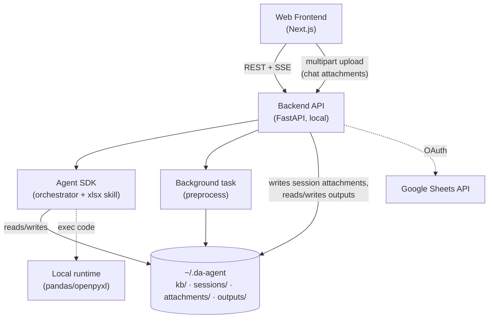
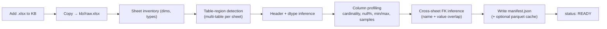
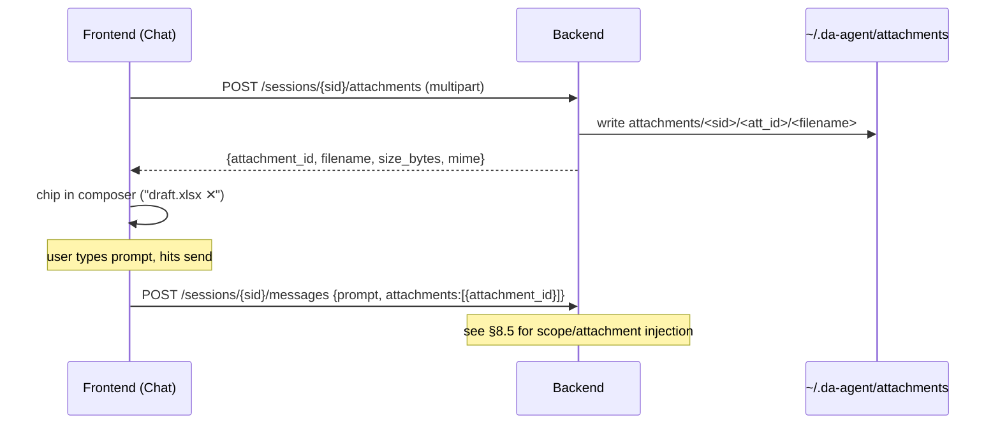
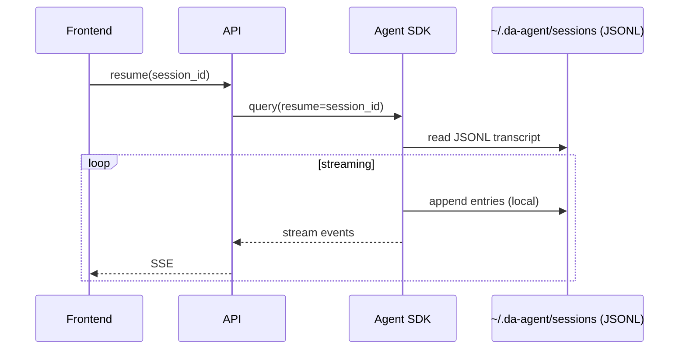
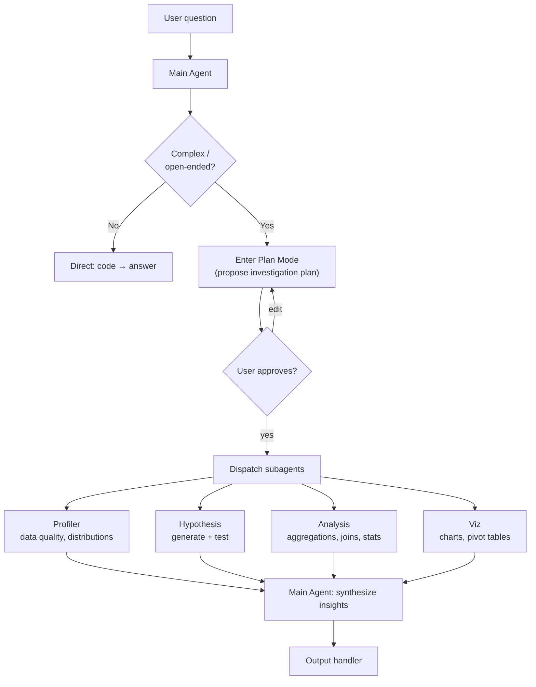
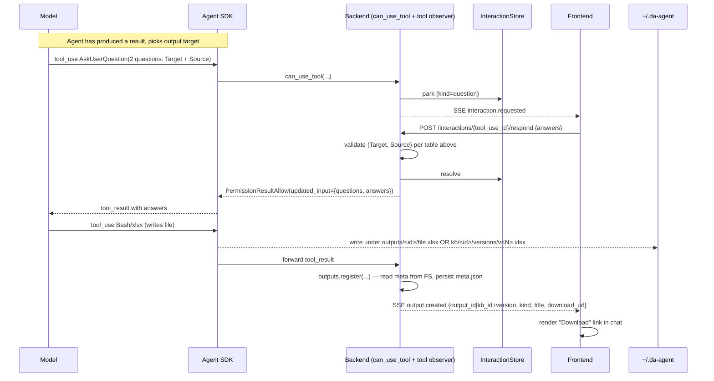
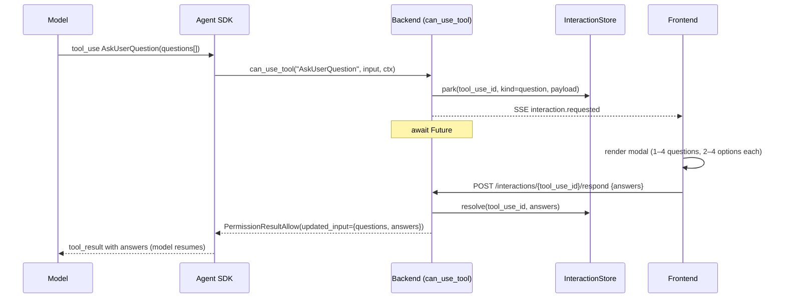
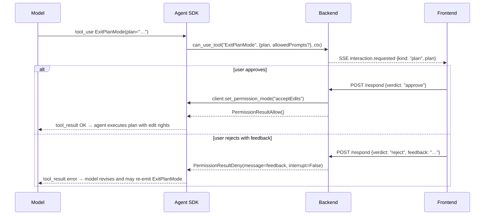
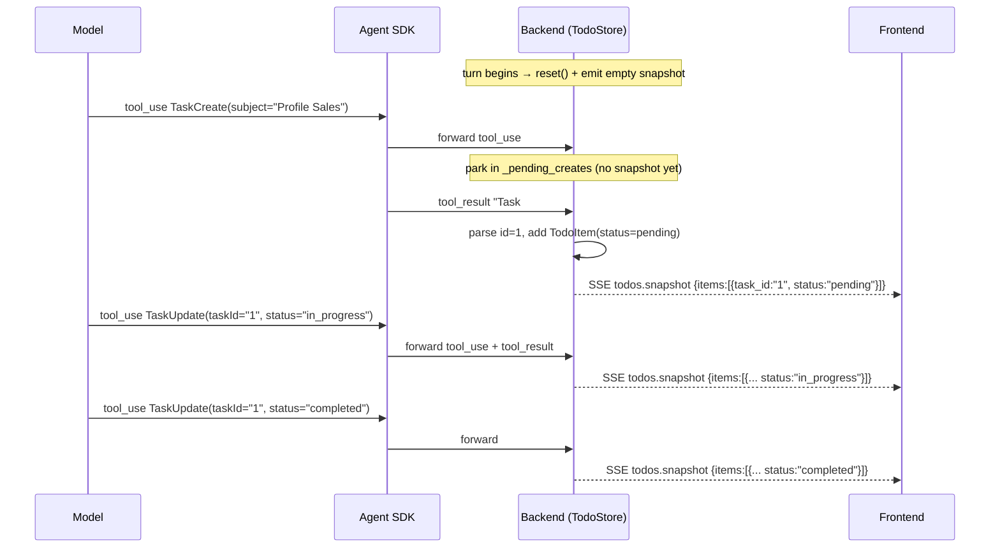
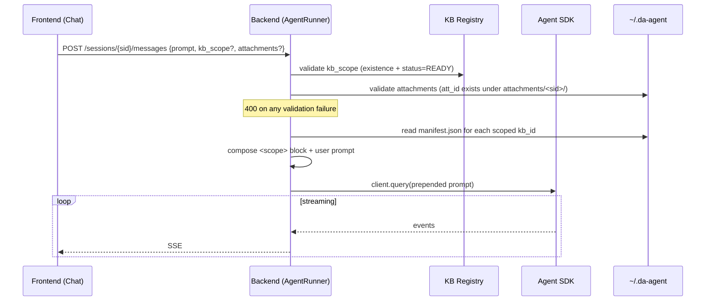

# Technical Spec — Excel Data-Analyst Agent

**Status:** Draft v2 · **Scope:** Single-user / internal tool · **Owner:** Ryan

> v2 change: local-first. No Postgres, no S3, no queue, no SessionStore adapter. Everything lives under `~/.da-agent` and the SDK's native local JSONL sessions.

---

## 1. Goal

An AI agent that ingests Excel files (1+ files, 1+ sheets), understands schema and cross-sheet relationships, answers questions from trivial lookups to multi-step inference, produces new artifacts (tables, charts, sheets), and runs an end-to-end Senior Data Analyst workflow. Built on the **Claude Agent SDK** with the **xlsx** skill, persisting everything to the **local filesystem**.

---

## 2. Key Decisions

| Topic | Decision | Rationale |
|---|---|---|
| Tenancy | Single-user, local | No auth/isolation needed |
| Storage | Local dir `~/.da-agent` (KB + artifacts) | No S3 |
| Sessions | SDK **default local JSONL** (`CLAUDE_CONFIG_DIR → ~/.da-agent/sessions`) | No Postgres, no custom adapter |
| Code execution | SDK local runtime (optional single Docker container for isolation) | No pool — local + local-JSONL removes the multi-host rationale |
| KB preprocessing | Local **background task** → compact `manifest.json` per file | No queue/broker; agent reads manifest not raw bytes |
| Output target | `.xlsx` download · new sheet · edit-in-place (new version) | Agent **asks user when ambiguous** |
| Google Sheets | CRUD via Sheets API (OAuth) | Import as KB / export results |

---

## 3. Architecture



**Boundary rule (unchanged, the core idea):** the LLM never receives raw spreadsheet bytes. It receives the **manifest** (schema/profile) and operates on data through **code executed in the runtime** (data pushdown). This caps token usage independent of file size.

---

## 4. Filesystem Layout

`~/.da-agent` *is* the database.

```
~/.da-agent/
├── config.toml
├── kb/
│   └── <kb_id>/
│       ├── raw.xlsx              # original (immutable)
│       ├── manifest.json         # agent's primary view (schema + profile)
│       ├── versions/             # non-destructive edits
│       │   ├── v2.xlsx
│       │   ├── v2.meta.json      # sidecar: which sheet(s) the agent added/overwrote in v2
│       │   └── …
│       └── cache/                # optional parquet/csv for fast pandas reads
├── outputs/                      # standalone artifacts not bound to any KB
│   └── <output_id>/
│       ├── file.xlsx
│       └── meta.json
├── attachments/                  # short-term per-session uploads (chat composer)
│   └── <session_id>/
│       └── <att_id>/<filename>
└── sessions/                     # SDK JSONL transcripts (CLAUDE_CONFIG_DIR)
    └── projects/<project>/<session_id>.jsonl
```

`attachments/` lives at the data-root level (parallel to `sessions/`) to avoid colliding with the SDK's `sessions/projects/<project>/<id>.jsonl` layout. `Settings` will gain `outputs_dir` and `attachments_dir` when this design is implemented; the existing `kb_dir` and `sessions_dir` are unchanged.

---

## 5. Input & Ingestion

Two ingestion paths, distinguished by **frontend entry point** and **lifetime**. Long-term ingest goes through preprocessing; short-term ingest does not.

| Path | Frontend entry | Lifetime | Preprocessing | Storage | Agent access |
|---|---|---|---|---|---|
| **KB (long-term)** | KB Manager screen — "Add file" / "Import from Sheets" | Persistent, reused across sessions | Yes — see §5.1, status `PENDING → PROCESSING → READY \| FAILED` | `kb/<kb_id>/raw.xlsx` + `manifest.json` | Reads `manifest.json`; xlsx skill for ad-hoc inspection |
| **Session attachment (short-term)** | Chat screen — drop file into composer | One session (deleted with the session) | **No** — the file is dropped as-is | `attachments/<session_id>/<att_id>/<filename>` | Direct read via xlsx skill (no manifest); referenced per-turn (see §8.5) |

The two paths never cross: a chat upload is never preprocessed into a KB silently, and a KB file is never copied into the session workdir. Promoting an attachment to KB is a deliberate user action on the KB Manager screen (out of scope for this spec).

### 5.1 Preprocessing Pipeline (local background task)



**`manifest.json`** — compact, the agent's primary view of a KB file:

```jsonc
{
  "kb_id": "kb_123",
  "sheets": [{
    "name": "Sales",
    "dims": {"rows": 48211, "cols": 12},
    "regions": [{
      "region_id": "Sales!A1",
      "range": "A1:L48211",
      "header_row": 1,
      "columns": [
        {"name": "order_id", "dtype": "int", "role": "pk?", "cardinality": 48211, "null_pct": 0},
        {"name": "customer_id", "dtype": "int", "role": "fk?->Customers.id", "null_pct": 0.2},
        {"name": "amount", "dtype": "float", "min": 0.5, "max": 9821.0, "null_pct": 0}
      ],
      "sample_rows": 5
    }]
  }],
  "relationships": [
    {"from": "Sales.customer_id", "to": "Customers.id", "confidence": 0.94}
  ]
}
```

### 5.2 Edge Cases

| Edge case | Handling |
|---|---|
| Huge files (many rows/cols) | Never load full sheet into context. Profile via streaming/sampling. All aggregation in pandas. Row caps on previews. |
| Multiple tables in one sheet | **Region-detection** pass: scan for contiguous non-empty blocks separated by blank row/col gaps; emit each as a `region` with its own header + range. |
| Merged cells / messy headers | Multi-row header collapse heuristic; flag low-confidence regions for the agent to inspect. |
| Mixed types in a column | dtype = `mixed`; coerce at analysis time in code. |

### 5.3 Short-term attachments (chat upload)

Files dropped into the chat composer are uploaded once and live for the lifetime of their session. They bypass preprocessing entirely — small, throwaway, ad-hoc.

**Endpoint:** `POST /sessions/{sid}/attachments` (multipart). Response:

```jsonc
{
  "attachment_id": "att_01HRZ…",   // ulid; stable for the session lifetime
  "filename": "draft.xlsx",         // original, sanitized (path components stripped)
  "size_bytes": 18422,
  "mime": "application/vnd.openxmlformats-officedocument.spreadsheetml.sheet",
  "uploaded_at": "2026-05-27T08:09:11Z"
}
```

**Storage:** `~/.da-agent/attachments/<session_id>/<att_id>/<filename>`. The `<att_id>` directory isolates filename collisions (two `report.xlsx` uploads coexist).

**Lifetime:** tied to the session — deleted when `DELETE /sessions/{sid}` is called. Forking a session (`POST /sessions/{sid}/fork`) does NOT copy attachments; the fork starts empty (parent's attachments would otherwise drift between branches).

**How the agent sees them:** the attachment file lives on the SDK's `add_dirs` (per-session, see §8.5). The agent reads it the same way it reads any file in its working directory. No manifest is generated; the model uses the xlsx skill on demand.

**Sequence — chat upload then send:**



**Edge cases:**

| Case | Handling |
|---|---|
| File >100 MB (config: `attachment_max_bytes`) | Reject with `413 Payload Too Large`. Big files belong in KB. |
| Non-xlsx mime | Accept any mime that the xlsx skill or a future skill can read; do not gate by extension. The agent figures it out. |
| Duplicate filename in same session | Different `att_id` directories — no collision on disk. FE may show both chips with disambiguating size/timestamp. |
| Attachment referenced by `attachment_id` that doesn't exist | `POST /messages` returns `400` with `unknown attachment_id` (see §8.5 validation). |
| Session deleted while attachment dir is large | Recursive delete is best-effort; failures are logged and the session record is removed regardless (orphan dirs are swept on next start). |

---

## 6. Session Persistence

Use the SDK's **default local behavior** — no adapter, no DB. Set `CLAUDE_CONFIG_DIR=~/.da-agent/sessions` so transcripts live with the tool's data. `query()`, `resume`, `continue`, `fork`, `listSessions`, and `delete` all operate on local JSONL out of the box.



No `mirror_error` concerns, no compaction-vs-raw split to manage at the storage layer — local JSONL is the single source of truth. Subagent transcripts are written alongside automatically.

---

## 7. KB Management (CRUD)

- **Create:** add `.xlsx` or import a Google Sheet → triggers preprocessing.
- **Read:** list `kb/` dirs + parse manifests; preview regions.
- **Update:** replace `raw.xlsx` → re-preprocess; analytic edits write to `versions/`.
- **Delete:** remove `kb/<id>/`.
- **Google Sheets:** import (Sheets API → export xlsx → ingest) and export results back to a sheet/tab.

---

## 8. Agent Design

| Capability | Mechanism |
|---|---|
| Understand schema + relationships | Reads `manifest.json`; xlsx skill for ad-hoc inspection |
| Simple Q&A (value lookup) | Single code call against cache/raw |
| Complex Q&A (multi-step inference) | Agent loop: plan → code → observe → synthesize |
| Create tables/charts/sheets | xlsx skill (openpyxl) |
| End-to-end analyst | **Plan Mode** + **Subagents** |

### 8.1 Analyst Orchestration



### 8.2 Output Handling

When the agent is about to produce a file, it must decide *where* the bytes land. If the target is unambiguous from the user's last message ("save it as a new file") the agent writes directly. Otherwise it asks — using the same `AskUserQuestion` pipeline defined in §8.3 (no bespoke clarification tool; the placeholder `ask_output_target` is removed).

**Three targets, three filesystem destinations:**

| Option label (≤12 char) | Description shown to user | Filesystem destination | Constraints |
|---|---|---|---|
| `New .xlsx` | Download a fresh standalone file | `~/.da-agent/outputs/<output_id>/file.xlsx` | No source KB needed. |
| `New sheet` | Append a new sheet to a source KB file | `~/.da-agent/kb/<kb_id>/versions/v<N>.xlsx` (copy of latest version with extra sheet) | Requires picking a `kb_id`. Must not collide with an existing sheet name in that file. |
| `Pick sheet` | Overwrite/append into an existing sheet of a source KB file | `~/.da-agent/kb/<kb_id>/versions/v<N>.xlsx` (copy of latest version with target sheet rewritten) | Requires picking a `kb_id` *and* a sheet name from that file's manifest. |

`raw.xlsx` is never touched. KB-bound options always copy the latest version (latest `vN.xlsx`, or `raw.xlsx` if no versions yet) into a fresh `v<N+1>.xlsx`, then mutate inside the copy — Golden Rule 4.

**Question chain (re-uses §8.3 pipeline verbatim):**

The agent emits ONE `AskUserQuestion` call with **two questions** in the same payload (the SDK schema allows 1–4 questions per call — no follow-up round-trip). The backend builds the `Source` options by **intersecting all READY KB files with the current turn's `kb_scope`** (see §8.5) — the model never sees a KB outside the turn's scope.

```jsonc
// SSE: interaction.requested (kind=question), payload sent to FE
{
  "type": "interaction.requested",
  "tool_use_id": "toolu_…",
  "kind": "question",
  "questions": [
    {
      "question": "Where should the result be written?",
      "header": "Target",                 // ≤12 chars
      "multiSelect": false,
      "options": [
        {"label": "New .xlsx",   "description": "Download a fresh standalone file"},
        {"label": "New sheet",   "description": "Add a new sheet to a source KB file"},
        {"label": "Pick sheet",  "description": "Write into an existing sheet of a source KB file"}
      ]
    },
    {
      "question": "Which KB file (and sheet, if applicable)?",
      "header": "Source",                 // ≤12 chars
      "multiSelect": false,
      // Backend intersects READY KB ∩ kb_scope; format "kb_<id>" for whole file,
      // "kb_<id>::<sheet>" for a specific sheet. FE shows nice labels; backend
      // strips back to ids when resolving. Always include "N/A" for the New .xlsx target.
      "options": [
        {"label": "Sales.xlsx",          "description": "Whole file (for: New sheet)"},
        {"label": "Sales.xlsx / Q1",     "description": "Sheet Q1 (for: Pick sheet)"},
        {"label": "Sales.xlsx / Q2",     "description": "Sheet Q2 (for: Pick sheet)"},
        {"label": "N/A",                 "description": "Choose if target is New .xlsx"}
      ]
    }
  ]
}
```

The model receives the answer through the standard `tool_result` flow defined in §8.3. The backend validates the (Target, Source) pair before resuming the SDK:

| Target chosen | Required `Source` shape | Validation on backend |
|---|---|---|
| `New .xlsx` | `N/A` | accept any |
| `New sheet` | `kb_<id>` (whole file) | `kb_<id>` exists, status=READY, in turn's `kb_scope` |
| `Pick sheet` | `kb_<id> / <sheet>` | sheet present in that file's `manifest.json` |

If validation fails, the backend returns `PermissionResultDeny(message="invalid target: …", interrupt=False)` — the model sees the error in `tool_result` and can re-emit the question (the §8.3 loop already handles malformed answers).

**Output registration:**

After the agent finishes writing, a backend tool-observer (same pattern as `TodoStore` in §8.4) detects the write site and calls `outputs.register(...)`:

- For `New .xlsx`: mints `output_id = out_<ulid>`, writes file under `outputs/<output_id>/file.xlsx`, writes `meta.json`, emits SSE.
- For `New sheet` / `Pick sheet`: bumps version (`v<N+1>.xlsx` under `kb/<kb_id>/versions/`), writes sidecar `v<N+1>.meta.json`, emits SSE referencing the new version. The download URL routes through the existing KB-version endpoint (see §11) — no separate `output_id` minted.

**`outputs/<output_id>/meta.json` schema:**

```jsonc
{
  "output_id": "out_01HRZ…",          // ulid
  "kind": "standalone",                // "standalone" | "kb_version"
  "title": "Q1 sales summary",         // model-supplied or filename-derived
  "filename": "file.xlsx",             // on disk under outputs/<output_id>/
  "mime": "application/vnd.openxmlformats-officedocument.spreadsheetml.sheet",
  "size_bytes": 18422,
  "source_session_id": "sess_…",       // session that produced it
  "source_kb_ids": [],                 // empty for standalone; populated if model copied data from KBs
  "created_at": "2026-05-27T08:11:02Z"
}
```

**`kb/<kb_id>/versions/v<N>.meta.json` schema** (sidecar for KB-bound writes):

```jsonc
{
  "version": "v3",                     // matches v3.xlsx
  "parent_version": "v2",              // or "raw" if first version
  "kind": "kb_version",
  "operation": "add_sheet",            // "add_sheet" | "overwrite_sheet"
  "sheet_affected": "Q1_summary",      // sheet name added or overwritten
  "source_session_id": "sess_…",
  "created_at": "2026-05-27T08:11:02Z"
}
```

**Sequence — output target resolution + write + register:**



A new SSE event type, `output.created`, is added to the list in §11. Frontends MUST treat unknown event types as no-ops (forward-compat clause already in §11 — no new policy).

### 8.3 Interactive User Loop (Plan & Question)

Two SDK tools — `AskUserQuestion` and `ExitPlanMode` — pause the agent until the user responds. In a web deployment the backend wraps the SDK with a `can_use_tool` callback that intercepts these tools, parks the call as a pending **interaction**, and pushes a request to the frontend over SSE. The frontend submits the answer over REST; the backend resolves the awaited future, and the SDK resumes the agent in place.

The current CLI reuses the same seam (see `agent/permissions.py::make_can_use_tool`) — the web pipeline only swaps the in-process UI Protocol for SSE + REST adapters; no SDK semantics change.

**Pipeline components:**

| Component | Role |
|---|---|
| `can_use_tool(tool_name, tool_input, ctx)` | Backend gate. Awaits a `Future` for `AskUserQuestion` and `ExitPlanMode`; returns `PermissionResultAllow()` for everything else without prompting. |
| `InteractionStore` | In-memory map `{session_id: {tool_use_id → PendingInteraction}}` holding `kind` (`question` / `plan`), payload, and `Future`. Lives in the FastAPI process; not persisted. |
| SSE channel on `/sessions/{id}/messages` | Pushes a fresh `interaction.requested` event whenever the gate parks a call. |
| `POST /sessions/{id}/interactions/{tool_use_id}/respond` | Frontend submits the answer; backend resolves the matching `Future`, removes the entry, and the SDK resumes immediately. |
| `GET /sessions/{id}/interactions/pending` | Reconnect/refresh recovery — returns any unresolved entries so the frontend can re-render their modals. |

**Sequence — `AskUserQuestion`:**



**Sequence — `ExitPlanMode`:**



**`AskUserQuestion` — wire payload:**

```jsonc
// SSE event sent to the frontend
{
  "type": "interaction.requested",
  "tool_use_id": "toolu_01ABC...",
  "kind": "question",
  "questions": [
    {
      "question": "Where should the chart be saved?",
      "header": "Output",                 // ≤12 chars (chip label, per SDK schema)
      "multiSelect": false,
      "options": [
        {"label": "New .xlsx",   "description": "Download a fresh file"},
        {"label": "Source file", "description": "Add as a new sheet"},
        {"label": "In place",    "description": "Edit, write to versions/"}
      ]
    }
  ]
}
```

```jsonc
// REST body — POST /sessions/{id}/interactions/{tool_use_id}/respond
{
  "answers": [
    {"header": "Output", "selected": ["New .xlsx"], "other_text": null}
  ]
}
```

```jsonc
// Backend feeds back to the SDK as updated_input
{
  "questions": [ /* verbatim from the tool call */ ],
  "answers": { "Where should the chart be saved?": "New .xlsx" }
}
```

The `answers` map keys each entry by the original `question` text and joins `selected` (plus `other_text` if present) with `", "`. This shape matches the SDK's expectation when it receives the `tool_result` — the model sees a clean prose reply.

**`ExitPlanMode` — wire payload:**

```jsonc
// SSE
{
  "type": "interaction.requested",
  "tool_use_id": "toolu_…",
  "kind": "plan",
  "plan": "1. Profile Sales sheet…\n2. Aggregate by month…\n3. Render chart…",
  "allowedPrompts": [{"tool": "Bash", "prompt": "run tests"}]
}

// REST — approve
{ "verdict": "approve" }

// REST — reject with revision hint
{ "verdict": "reject", "feedback": "skip step 3 for now" }
```

**Edge cases:**

| Case | Handling |
|---|---|
| Frontend refresh / reconnect mid-question | `InteractionStore` is in-memory and survives the websocket drop. On reconnect, the frontend calls `GET /interactions/pending` and re-renders the unresolved entries. |
| User dismisses the modal | Frontend MUST send a response. For a question, an empty `selected` is converted by the backend into `PermissionResultDeny(message="user declined to answer", interrupt=False)`; for a plan, send `{verdict: "reject", feedback: "user dismissed"}`. The model gets a clean signal instead of hanging. |
| Multiple questions in one call (1–4) | Single SSE event, single REST response with one `Answer` per `header`. |
| Free-text "Other" | Frontend appends `other_text` to the `selected` list before sending; backend joins both into the answer string. |
| Two interactions queued back-to-back | Each has a unique `tool_use_id`; frontend keeps a queue and renders them sequentially. |
| Backend restart while a `Future` is awaited | The SDK call is lost. The backend should respond `503` to the next message attempt and require the user to retry the turn. (Persisting interactions across restarts is an open question — see §14.) |
| Timeout | No automatic timeout: the agent is genuinely waiting on the user. A long-idle warning in the UI is a UX choice, not a backend kill. |

### 8.4 Todo List Streaming Pipeline

The agent plans multi-step work via the SDK's task tools — `TaskCreate`, `TaskUpdate`, `TaskGet`, `TaskList` — plus the legacy `TodoWrite`. The frontend renders this as a live checklist that mirrors the agent's internal plan. Each tool call is observed by a backend `TodoStore` (see `agent/todos.py`) which derives an immutable `TodoSnapshot` and pushes it to the frontend over SSE. The store is reset at the start of every user turn.

**Frontend invariant:** rows are added/updated/removed *only* in response to a snapshot derived from a **completed** task tool. The frontend never speculates from a `tool_use` alone — it waits for the matching `tool_result` to land before mutating its render. This guarantees a row never disappears mid-flight (e.g. the agent emits `TaskUpdate(deleted)` but the SDK fails to apply it) and that `TaskCreate` rows only appear once the SDK has assigned an id.

**Pipeline components:**

| Component | Role |
|---|---|
| `TodoStore` (backend) | Observes `tool_use` + `tool_result` blocks for the task tools. Internal state: `_tasks: dict[task_id, TodoItem]`, `_order: list[task_id]`, `_pending_creates: dict[tool_use_id, dict]`. |
| Snapshot derivation | After any state-changing tool *result*, the store emits `TodoSnapshot(items=…)` to the SSE channel as a `todos.snapshot` event. Snapshots are full state, not deltas — idempotent and safe to drop. |
| Turn reset | At the top of `AgentRunner.send`, `TodoStore.reset()` is called and an empty snapshot is pushed before `client.query()`. This keeps todos turn-scoped (matches the CLI semantics). |

**Lifecycle:**

```
TaskCreate(tool_use)            → park in _pending_creates, no snapshot
TaskCreate(tool_result "Task #N created successfully: <subject>")
                                → parse id (regex), upsert TodoItem(status=PENDING),
                                  push snapshot
TaskUpdate(tool_use, status=in_progress|completed)
                                → mutate item.status, push snapshot
TaskUpdate(tool_use, status=deleted)
                                → remove from _tasks/_order, push snapshot
TaskGet / TaskList              → read-only, no snapshot
TodoWrite(tool_use, todos=[…])  → rewrite all items, push snapshot
turn boundary                   → reset(), push empty snapshot
```

The SDK CLI emits `TaskCreate` results as a **plain string** of the form `"Task #<id> created successfully: <subject>"`, so the store extracts the id with `r"Task\s*#(\S+)\s+created successfully"` first, then falls back to JSON (`task.id` / `id`) and finally to `local-<tool_use_id>` to keep the row identifiable.

**Sequence:**



**Snapshot payload:**

```jsonc
{
  "type": "todos.snapshot",
  "session_id": "sess_…",
  "items": [
    {
      "task_id": "1",
      "subject": "Profile Sales",
      "active_form": "Profiling Sales",   // present continuous, shown while in_progress
      "status": "in_progress",            // pending | in_progress | completed
      "description": ""
    }
  ]
}
```

A **deletion** is conveyed implicitly: the next snapshot omits the row. The frontend diffs by `task_id` and removes any row not present.

**Frontend rendering rules:**

- Persistent overlay (bottom-anchored), separate from the message stream — does not scroll with chat history.
- Glyphs: `✔` completed · `▪` in_progress · `□` pending.
- For the single in-progress task, replace the spinner label with that task's `active_form`.
- Render rows ONLY from `todos.snapshot` events — never from raw `tool.use` events.

**Edge cases:**

| Case | Handling |
|---|---|
| `TaskUpdate` arrives before its `TaskCreate` result | Synthesize a stub `TodoItem` (subject empty, `active_form` empty) keyed by `taskId`; the later create result fills `subject`. |
| `TaskCreate` result string can't be parsed | Use `local-<tool_use_id>` as the id. The model can only `TaskUpdate` with the id the SDK gave it back, so unmatched updates are dropped silently — acceptable failure mode. |
| Legacy `TodoWrite` mixed with `Task*` | `TodoWrite` rewrites the entire snapshot (input field `todos` with `content` → `subject`, `activeForm` → `active_form`, `status`). Both paths share the same `TodoSnapshot` shape downstream. |
| Frontend reconnect mid-turn | On reconnect, the backend re-emits the current snapshot once. No replay of historical snapshots — the latest is authoritative. |
| Status the model invents (e.g. `"blocked"`) | Coerced via `TodoStatus(status_raw)`; on `ValueError`, the item keeps its previous status. |
| Very long task lists | The overlay caps display to N rows (configurable, default 8); overflow shows `… +K more`. The snapshot itself is uncapped. |

### 8.5 Per-turn Data Scope

The agent does not operate over "all files on disk". Each turn carries an explicit **scope** assembled by the frontend and validated by the backend. Scope has two channels:

- **KB scope** — a list of KB ids the user has ticked on the chat screen. Default (omitted/null) = **all KB files with status=READY**. Files in non-READY status are never reachable in this turn even if their id is supplied.
- **Attachments** — short-term files uploaded for this session via §5.3. The user picks which attachments come along on this turn.

**KB lifecycle status** (now an explicit field on `GET /kb/files`):

| Status | Meaning | Checkable on chat screen? |
|---|---|---|
| `PENDING` | Just uploaded, preprocess not started | No |
| `PROCESSING` | Background task running (§5.1) | No |
| `READY` | `manifest.json` written | **Yes** |
| `FAILED` | Preprocess errored; reason in manifest stub | No |

The frontend disables (greys out) checkboxes for non-READY rows and shows the status as a chip. Polling/refresh is the FE's responsibility — the spec does not mandate a status SSE channel for it (open question, §14).

**Extended `MessageRequest` body** (`POST /sessions/{sid}/messages`):

```jsonc
{
  "prompt": "compare Q1 vs Q2 and chart the delta",
  // OPTIONAL. Omitted or null → all READY KB files (default-all).
  // Empty array → 400 (use omission, not [], to mean "default-all"; see edge cases).
  "kb_scope": ["kb_123", "kb_456"],
  // OPTIONAL. Omitted or null → no short-term attachments injected this turn.
  "attachments": [{"attachment_id": "att_01HRZ…"}]
}
```

Both new fields are **optional** — existing clients that send only `{prompt}` keep working (default-all KB, no attachments). This is the only backwards-compat surface.

**Validation rules** (executed before the SDK is started for the turn):

| Rule | Status | Body |
|---|---|---|
| `kb_scope` is `[]` (empty array) | `400` | `{"error": "kb_scope cannot be empty; omit the field for default-all"}` |
| `kb_scope` references unknown id | `400` | `{"error": "unknown kb_id: <id>"}` |
| `kb_scope` references non-READY id | `400` | `{"error": "kb <id> is in status <X>; only READY files can be scoped"}` |
| `attachments[].attachment_id` not found in this session | `400` | `{"error": "unknown attachment_id: <id>"}` |
| Same `attachment_id` twice | `400` | `{"error": "duplicate attachment_id"}` |

**Injection mechanism — prepended scope block:**

`AgentRunner.send` builds a per-turn context block and prepends it to the user prompt before calling `client.query()`. Reasons:

1. The SDK's `add_dirs` is constructor-time today; rebuilding per turn requires either restarting the client or relying on undocumented dynamics.
2. The context block lands in the local JSONL transcript — debuggable, replayable, visible to subagents.
3. KB manifests are tiny (Golden Rule 1: manifest in, code-pushdown out) — the cost of including N of them per turn is bounded.

The block is composed as:

```
<scope>
For this turn, only these KB files are in scope:
- kb_123 (Sales.xlsx) — manifest at /…/kb/kb_123/manifest.json
- kb_456 (Inventory.xlsx) — manifest at /…/kb/kb_456/manifest.json

Short-term attachments (no manifest, read directly with xlsx skill):
- /…/attachments/<sid>/att_…/draft.xlsx
</scope>

<user_prompt>
compare Q1 vs Q2 and chart the delta
</user_prompt>
```

When `kb_scope` is omitted/null, the block lists every READY KB. When `attachments` is omitted/null, the second sub-list is omitted. The system prompt (`build_system_prompt`) instructs the model that anything not in the `<scope>` block is off-limits for this turn.

**`add_dirs` strategy:** the SDK still gets `add_dirs=[kb_dir, attachments_dir/<sid>, outputs_dir]` at construction time so the filesystem is *reachable*. The scope block is what *bounds* the model's attention. This separation matters: a model that ignores the scope instruction still cannot write to a KB outside scope (the can_use_tool / Golden-Rule-4 layer prevents it), but it also cannot read other KBs because the scope tells it which manifest files to consult — the others are never named.

**Sequence — message turn with explicit scope:**



**Edge cases:**

| Case | Handling |
|---|---|
| `kb_scope: []` | `400` (see validation table). Empty list is ambiguous — force the client to be explicit. |
| `kb_scope` field absent vs. `kb_scope: null` | Both treated as default-all. |
| User checks a KB, FE sends turn, KB transitions READY → FAILED mid-turn | Validated at turn start; mid-turn transitions are not detected. Acceptable — preprocess re-runs are not destructive (write a new manifest, agent already has the old path). |
| Scope changes between turns of the same session | Allowed — each turn has its own `<scope>` block. The transcript records both. |
| Very large scope (e.g. 100 KBs default-all) | Manifests are bounded per Golden Rule 1, but the assembled block can still be sizable. Soft cap: log a warning if total manifest bytes >`scope_warn_bytes` (default 256 KB). Hard cap is an open question (§14). |
| Attachment referenced but not on disk (race with delete) | Treated like unknown attachment_id → `400`. |

---

## 9. Frontend

Simple local web app. Suggested: **Next.js + React + Tailwind**, streaming via SSE.

| Page | Function |
|---|---|
| Chat | Stream agent turns; plan-mode approval modal; AskUserQuestion modal; live todo-list overlay; show tool/subagent activity; download outputs; **KB scope picker (READY rows checkable, others greyed); short-term file upload (drop-zone in composer)** |
| KB Manager | Add / import-from-Sheets / list / re-sync / delete; view manifest + region preview; **show file status (`PENDING` / `PROCESSING` / `READY` / `FAILED`)** |
| Sessions | List, resume, rename, fork, delete |

---

## 10. Tech Stack

| Layer | Choice |
|---|---|
| Agent / Backend | Python, **Claude Agent SDK**, FastAPI |
| Skill | Anthropic **xlsx** skill (pandas, openpyxl) |
| Execution | SDK local runtime (optional single Docker container for isolation) |
| Storage | Local filesystem `~/.da-agent` |
| Sessions | SDK default local JSONL (`CLAUDE_CONFIG_DIR`) |
| Integrations | Google Sheets API (OAuth) |
| Frontend | Next.js + React + Tailwind, SSE |

*Dropped vs v1: Postgres, S3, Celery/RabbitMQ, custom SessionStore adapter, container pool.*

---

## 11. Core API Surface

| Method | Endpoint | Purpose |
|---|---|---|
| POST | `/kb/files` | Add xlsx → trigger preprocess |
| POST | `/kb/files/import-sheet` | Import Google Sheet as KB |
| GET | `/kb/files` · `/kb/files/{id}/manifest` | List / inspect |
| DELETE | `/kb/files/{id}` | Delete KB dir |
| POST | `/sessions` | Create session |
| GET | `/sessions` · `/sessions/{id}` | List / resume metadata |
| POST | `/sessions/{id}/messages` | Send turn (SSE stream back). Body: `{prompt, kb_scope?, attachments?}` — see §8.5 for shape and validation. |
| POST | `/sessions/{sid}/attachments` | Upload a short-term file for the session (multipart). Returns `{attachment_id, filename, size_bytes, mime, uploaded_at}`. |
| GET  | `/sessions/{sid}/attachments` | List attachments for a session. |
| DELETE | `/sessions/{sid}/attachments/{att_id}` | Remove a single attachment. |
| POST | `/sessions/{id}/interactions/{tool_use_id}/respond` | Resolve a paused interaction (`AskUserQuestion` answers or `ExitPlanMode` verdict) |
| GET | `/sessions/{id}/interactions/pending` | List unresolved interactions (used on reconnect/refresh to re-render modals) |
| POST | `/sessions/{id}/fork` | Fork |
| GET  | `/outputs` | List standalone outputs (kind=standalone). Query: `?session_id=…` filter. |
| GET  | `/outputs/{output_id}` | Download standalone xlsx (streams `file.xlsx`). |
| GET  | `/outputs/{output_id}/meta` | Return `meta.json` for a standalone output. |
| DELETE | `/outputs/{output_id}` | Remove `outputs/<output_id>/`. |
| GET  | `/kb/files/{kb_id}/versions` | List versions (`v2`, `v3`, …) with sidecar meta. |
| GET  | `/kb/files/{kb_id}/versions/{version}/download` | Download a specific KB version (used as the download URL for `kind=kb_version` outputs). |

**SSE event types** emitted on `POST /sessions/{id}/messages`: `assistant.text`, `assistant.thinking`, `tool.use`, `tool.result`, `system`, `result`, `interaction.requested`, `todos.snapshot`, `output.created`, `error`. Frontends MUST treat unknown event types as no-ops (forward-compat).

---

## 12. Golden Rules

1. **LLM never sees raw bytes.** Manifest in, code-pushdown out — caps tokens regardless of file size.
2. **Aggregation happens in pandas, not in the model.** The agent writes/executes code; it does not "read" 48k rows.
3. **Local JSONL is the single source of truth** for sessions. Don't reinvent persistence.
4. **Writes are non-destructive.** Edits go to `versions/`; `raw.xlsx` is immutable.
5. **Ambiguous output → ask, don't guess.**

## 13. Anti-Patterns

- ❌ Dumping full sheets into the prompt "so the model has context."
- ❌ Adding a DB/queue/object-store for a single-user local tool.
- ❌ Overwriting `raw.xlsx` in place.
- ❌ Treating one sheet as one table (breaks on multi-region sheets).
- ❌ Auto-resolving `AskUserQuestion` / `ExitPlanMode` without user input (defeats the human-in-the-loop guarantee — see §8.3 and Golden Rule 5).
- ❌ Rendering todo rows from `tool.use` events alone — wait for the `todos.snapshot` derived from the matching `tool_result` (see §8.4).
- ❌ Hardcoding a placeholder tool like `ask_output_target` instead of `AskUserQuestion` (breaks the §8.3 pipeline; FE has no modal for it).
- ❌ Writing standalone outputs anywhere other than `~/.da-agent/outputs/<output_id>/` (frontend download URL becomes guesswork).
- ❌ Mutating an existing `v<N>.xlsx` in place when adding/overwriting a sheet — always copy → `v<N+1>.xlsx` (preserves the non-destructive chain from Golden Rule 4).
- ❌ Letting the user check a KB whose status is not `READY` (race with the §5.1 preprocess pipeline — manifest may not exist yet, or may be rewritten under the agent's feet).
- ❌ Treating `kb_scope: []` as "no KBs in scope" — empty list is rejected with `400`; "no KBs" is expressed by sending only attachments (with all KBs unticked through an explicit subset).
- ❌ Per-turn rebuilding of the SDK's `add_dirs` to enforce scope — use the `<scope>` system block instead (debuggable, replayable, no SDK lifecycle churn).

---

## 14. Open Questions

- Optional code-execution isolation: bare local runtime vs. one Docker container — pick at impl based on how much you trust agent-written code.
- Cleanup policy for old `versions/` and session JSONL.
- Google Sheets auth flow for a local single user (loopback OAuth vs. service account).
- Interaction state durability (§8.3): `InteractionStore` is in-memory; should pending interactions survive a backend restart, or is reload-and-resume sufficient for a single-user tool?
- Todo overlay row cap (§8.4): is a fixed cap (default 8) acceptable, or should the overlay scroll/collapse instead?
- Scope size cap (§8.5): should the assembled `<scope>` block have a hard byte cap (vs. only the warn-level cap proposed)? Relevant once a user has dozens of KBs and uses default-all.
- Attachment retention (§5.3, §8.5): attachments live for the session lifetime — do we need a per-attachment TTL or size-based eviction inside a long-running session?
- KB status SSE channel (§8.5): should status transitions push to the chat screen so the checkbox un-greys without polling, or is FE-side polling sufficient?
- Output retention (§8.2): cleanup policy for `~/.da-agent/outputs/` (already adjacent to the existing `versions/` cleanup question).
